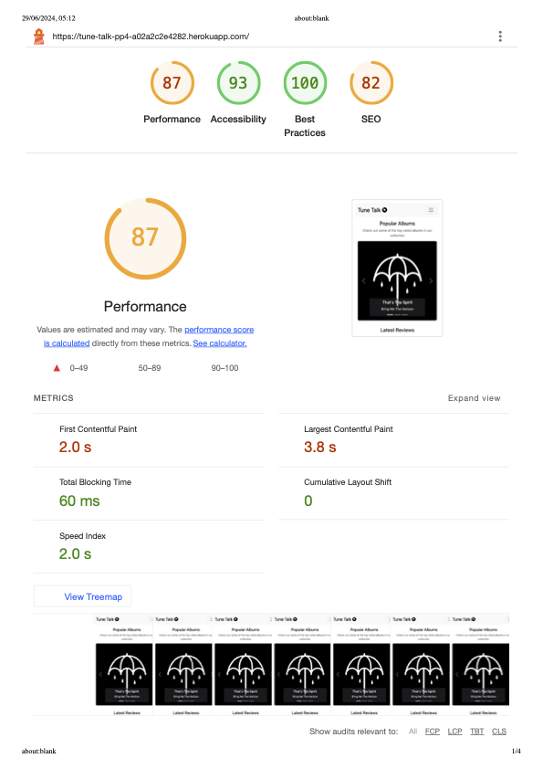

<h1 align="center">Tune Talk 🎶</h1>

[View the live website here.](https://tune-talk-pp4-a02a2c2e4282.herokuapp.com/)

## Project Rationale

Tune Talk is a Django-based web application for music lovers to explore artists, albums, and write reviews. Users can register, log in, and share their thoughts on various albums. The application uses the Spotipy library to fetch data from the Spotify API.

<h2 align="center"></h2>

## CONTENT

* [Design](#design)
  * [Imagery](#imagery)
  * [Wireframes](#wireframes)

* [Features](#features)
  * [General Features on Each Page](#general-features-on-each-page)
  * [Home Page](#home-page)
  * [About Page](#about-page)
  * [Charts Page](#charts-page)
  * [Album List Page](#album_list-page)

* [Technologies Used](#technologies-used)
  * [Languages Used](#languages-used)
  * [Frameworks, Libraries & Programs Used](#frameworks-libraries--programs-used)

* [Entity-Relationship Diagram (ERD)](#entity-relationship-diagram-erd)

* [Testing](#testing)
  * [Code Validation](#code-validation)
  * [Accessibility and Performance Test](#accessibility-and-performance-test)
  * [Feature Testing](#feature-testing)
  * [Browser Support Testing](#browser-support-testing)
  * [Device Compatibility](#device-compatibility)
  * [Tools Testing](#tools-testing)

* [Bugs](#bugs)

* [Credits](#credits)
  * [Code](#code)
  * [Content](#content)
  * [Media](#media)
  * [Acknowledgements](#acknowledgements)

## Design <h5>[Back To top](#contents)</h5>

### Imagery

* Images were chosen to complement the music theme, with album artwork and artist images being prominently featured. Media content was provided by Spotify and retrieved using the Spotipy library.

### Wireframes

* Wireframes were created to plan the layout and structure of the application. There are wireframes for web, iPad, and iPhone, with 5 pages wireframed and 3 variations for each page.

#### Home Page Wireframes

  
  
  

#### About Page Wireframes

  
  
  

#### Charts Page Wireframes

  
  
  

#### Album List Page Wireframes

  
  
  

#### Album Detail Page Wireframes

  
  
  

## Features <h5>[Back To top](#contents)</h5>

### General Features on Each Page

* **Navigation Bar**
  * Allows users to easily navigate to different sections of the site.
  * Features include links to the home page, about page, register, and sign-in pages.

### Home Page

* **Album List**
  * Displays a list of albums with their artwork, titles, and average ratings fetched from the Spotify API.
  * Users can click on an album to view more details and reviews.

### About Page

* **About Information**
  * Provides information about the purpose and mission of the site.
  * Details the inspiration behind Tune Talk and its features.

### Register Page

* **Registration Form**
  * Allows new users to create an account.
  * Users need to provide a username, email, and password.

### Sign In Page

* **Login Form**
  * Allows existing users to log in.
  * Users need to provide their username and password.

## Technologies Used <h5>[Back To top](#contents)</h5>

### Languages Used

* [Python](https://www.python.org/)
* [HTML5](https://en.wikipedia.org/wiki/HTML5)
* [CSS3](https://en.wikipedia.org/wiki/Cascading_Style_Sheets)
* [JavaScript](https://en.wikipedia.org/wiki/JavaScript)

### Frameworks, Libraries & Programs Used

* [Django](https://www.djangoproject.com/)
  * Used as the web framework for developing the application.
* [Bootstrap](https://getbootstrap.com/)
  * Used for responsive design and styling.
* [jQuery](https://jquery.com/)
  * Used for DOM manipulation and event handling.
* [Font Awesome](https://fontawesome.com/)
  * Used for icons.
* [Spotipy](https://spotipy.readthedocs.io/)
  * Used to fetch data from the Spotify API.
* [Mock](https://mock.readthedocs.io/en/latest/)
  * Used to mock data for Spotify API tests.
* [Git](https://git-scm.com/)
  * Used for version control.
* [GitHub](https://github.com/)
  * Used to store the project's code.

## Entity-Relationship Diagram (ERD) <h5>[Back To top](#contents)</h5>

### ERD

* **Artist**
  - artist_id: CharField (Primary Key)
  - artist_name: CharField

* **Album**
  - album_id: CharField (Primary Key)
  - title: CharField
  - artist_id: ForeignKey (Artist)
  - artwork: URLField
  - released: CharField

* **Review**
  - id: AutoField (Primary Key)
  - album_id: ForeignKey (Album, related_name="reviews")
  - author_id: ForeignKey (User)
  - title: CharField
  - rating: PositiveSmallIntegerField
  - body: TextField
  - created_at: DateTimeField

* **About**
  - id: AutoField (Primary Key)
  - title: CharField
  - content: TextField

## Testing <h5>[Back To top](#contents)</h5>

### Code Validation

The following validators were used to ensure code quality:

* [W3C HTML Validator](https://validator.w3.org/)
* [W3C CSS Validator](https://jigsaw.w3.org/css-validator/)
* [PEP8 CI Python Validator](https://pep8ci.herokuapp.com/)

### Accessibility and Performance Test

* Lighthouse in Chrome DevTools was used to test accessibility and performance.
  * Desktop Results
  
  * Mobile Results
  

### Feature Testing

* **User Registration**
  * Tested registration with valid and invalid data.
* **Login**
  * Tested login with correct and incorrect credentials.
* **Review Creation**
  * Tested creating, editing, and deleting reviews.
* **Album List**
  * Tested album list loading and display.
* Testing was conducted using Django's built-in testing framework.

### Browser Support Testing

| Device/Browser | Expected Performance | Testing Performed | Result |
| --- | --- | --- | --- |
| Google Chrome | Full functionality | Tested all features | Passed |
| Safari | Full functionality | Tested all features | Passed |
| Firefox | Full functionality | Tested all features | Passed |
| Microsoft Edge | Full functionality | Tested all features | Passed |

### Device Compatibility

| Device | Outcome | Pass/Fail |
| --- | --- | --- |
| MacBook Air M2 | No issues | Pass |
| iPhone 15 Pro | No issues | Pass |
| iPad Air | No issues | Pass |
| Android Phone | No issues | Pass |

### Tools Testing

* [Chrome DevTools](https://developer.chrome.com/docs/devtools/)
  * Used for debugging and testing responsiveness.

## Credits <h5>[Back To top](#contents)</h5>

### Code

* [Django Documentation](https://docs.djangoproject.com/)
* [Stack Overflow](https://stackoverflow.com/)
* [CSS-Tricks](https://css-tricks.com/)
* [W3Schools](https://www.w3schools.com/)

### Content

* Content was created by the developer.

### Media

* Media content was provided by Spotify and retrieved using the Spotipy library.

### Acknowledgements

* My mentor for guidance and feedback.
* My peers for their support and testing.